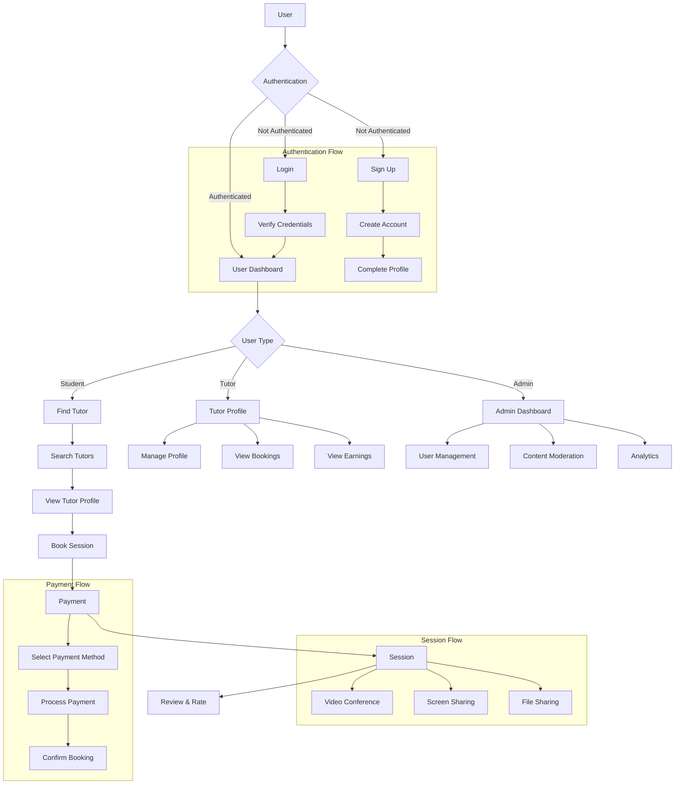

# P2P Tutoring Application Flowchart

## Key Components

1. **Authentication**
   - Sign Up
   - Login
   - Profile Completion

2. **Student Features**
   - Search Tutors
   - View Profiles
   - Book Sessions
   - Make Payments
   - Attend Sessions
   - Leave Reviews

3. **Tutor Features**
   - Profile Management
   - Booking Management
   - Earnings Tracking
   - Session Conducting

4. **Admin Features**
   - User Management
   - Content Moderation
   - System Analytics

5. **Session Features**
   - Video Conferencing
   - Screen Sharing
   - File Sharing
   - Chat

6. **Payment System**
   - Multiple Payment Methods
   - Secure Transactions
   - Booking Confirmation

## Data Flow

1. User Registration → Profile Creation → Authentication
2. Tutor Search → Profile View → Booking → Payment → Session
3. Session → Review → Rating → Profile Update
4. Admin → User Management → Content Moderation → Analytics 